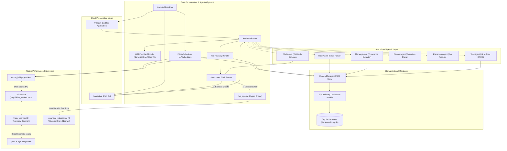
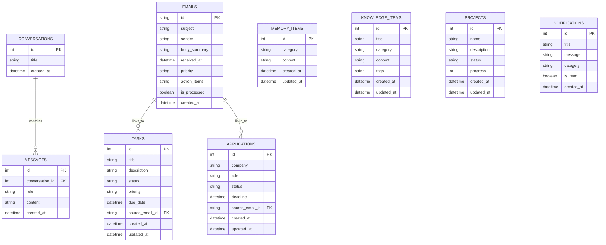

# FRIDAY System Architecture & Implementation Blueprint

This document serves as the formal technical specification and system architecture definition for **FRIDAY**, a high-performance, intelligent desktop AI assistant designed for Linux environments (optimized for Fedora KDE).

---

## 1. Overview and Project Goals

FRIDAY is a localized desktop companion engineered to bridge natural language understanding with direct system operation, telemetry monitoring, and personal management plugins.

### 1.1 Core Objectives
*   **Zero-Latency Telemetry**: Provide real-time system performance insights without blocking Python event loops or spawning slow sub-processes.
*   **Reliable Knowledge Management**: Sync personal details, career placement databases, search indexes, and tasks locally.
*   **Proactive Integration**: Sync incoming communications (e.g. Gmail) in the background to raise notifications and extract tasks.
*   **Strict Security & Determinism**: Limit command execution to whitelisted structures, preventing LLM hallucinations from causing destructive system state changes.

---

## 2. High-Level System Architecture

The overall system structure is split into three main layers: Client Presentation (PySide6 / CLI), Core Orchestration (Python Engine / Agents / DB), and Native Telemetry (C Daemon / IPC).



---

## 3. Component Breakdown

### 3.1 Presentation Components
*   **Main Window (`app/ui/main_window.py`)**: Root layout containing sidebar navigation, status header (displaying CPU/RAM/Battery status fetched periodically), and container views.
*   **Chat View (`app/ui/views/chat_view.py`)**: Renders message bubbles, thinking animations, and captures user text inputs for dispatch to the assistant.
*   **Dashboard View (`app/ui/views/home_view.py`)**: Renders grid cards (health charts, calendar items, current tasks, urgent emails) that refresh every 30 seconds.

### 3.2 Orchestration Components
*   **Assistant (`app/core/assistant.py`)**: Tracks active conversation IDs, routes incoming text requests to appropriate agents or static tools, constructs the LLM context, and enforces system prompt constraints.
*   **Tool Registry (`app/core/tools.py`)**: A centralized routing system mapping keyword tokens to dedicated diagnostic functions (e.g. `get_system_info`, `get_top_processes`, `get_battery_info`, `get_system_time`).
*   **Shell Sandbox (`app/core/shell.py`)**: Parses terminal command lines, matches command binaries against a whitelist, checks arguments against a blacklist, and executes safe commands.
*   **Ctypes Bridge (`app/core/fast_ops.py`)**: A high-performance bridge loading compiled C libraries (`command_validator.so`) to offload security validation checks with dynamic Python fallback.

### 3.3 Persistence Components
*   **Database Engine (`app/memory/database.py`)**: Configures SQLite, enables multi-threaded connections (`check_same_thread=False`), handles connection pooling, and sets up session cleanup context managers.
*   **Memory Manager (`app/memory/memory_manager.py`)**: Provides clean static CRUD operations for storing and fetching emails, tasks, memory facts, notification history, and projects.

### 3.4 Telemetry Components
*   **C Monitor Daemon (`native/friday_monitor.c`)**: Performance daemon caching memory, network, battery, thermal, and process stats.
*   **Bridge Client (`app/core/native_bridge.py`)**: Connects to the Unix socket, writes command lines, reads buffer lines, and translates raw text replies into structured Python dict models.

---

## 4. Folder / File Structure

```text
FRIDAY/
├── app/
│   ├── __init__.py
│   ├── agents/                     # LLM agent definitions
│   │   ├── __init__.py
│   │   ├── inbox_agent.py          # Email scanning agent
│   │   ├── memory_agent.py         # Fact extractor
│   │   ├── placement_agent.py      # Internship tracking
│   │   ├── planner_agent.py        # Decomposition planner
│   │   ├── shell_agent.py          # CLI command builder
│   │   └── task_agent.py           # NLP task parser
│   ├── core/                       # Core system logic
│   │   ├── __init__.py
│   │   ├── assistant.py            # Chat orchestration
│   │   ├── config.py               # Env configuration
│   │   ├── fast_ops.py             # Ctypes validation loader
│   │   ├── logger.py               # Logging helper
│   │   ├── native_bridge.py        # IPC Unix Socket wrapper
│   │   ├── shell.py                # Sandbox terminal runner
│   │   └── tools.py                # Tool declarations & routing
│   ├── email/                      # Email processing
│   │   ├── __init__.py
│   │   ├── analyzer.py             # NLP extraction from mail bodies
│   │   └── gmail.py                # Gmail API client wrapper
│   ├── llm/                        # LLM provider abstractions
│   │   ├── __init__.py
│   │   └── provider.py             # Groq / OpenAI / Gemini connectors
│   ├── memory/                     # Local SQLite DB layer
│   │   ├── __init__.py
│   │   ├── backup.py               # Local SQLite backup utility
│   │   ├── database.py             # Session and engine builders
│   │   ├── memory_manager.py       # Thread-safe CRUD interfaces
│   │   └── models.py               # SQLAlchemy declarations
│   ├── plugins/                    # Extensible utilities
│   │   ├── __init__.py
│   │   └── internship_scanner/
│   │       ├── __init__.py
│   │       └── scanner.py          # Web scraper plugin
│   ├── scheduler/                  # Background scheduler
│   │   ├── __init__.py
│   │   └── service.py              # Chron jobs orchestrator
│   └── ui/                         # PySide6 desktop views
│       ├── __init__.py
│       ├── main_window.py          # Main application skeleton
│       ├── stylesheet.py           # Stylesheet rules (QSS)
│       └── views/                  # UI view panels
├── database/                       # DB storage folder
├── logs/                           # System log files
├── native/                         # Native C monitoring daemon source
│   ├── Makefile                    # Compiles C monitor daemon & command validator shared library
│   ├── command_validator.c         # Fast C whitelist command validator
│   ├── command_validator.so        # Compiled command validator shared library
│   └── friday_monitor.c            # Telemetry monitor C daemon
├── main.py                         # Startup bootstrapper
├── friday.service                  # systemd user service script
└── requirements.txt                # Python dependencies
```

---

## 5. Core Runtime Flow

The sequence diagram below displays the system behavior when a user asks about RAM consumption:

```mermaid
sequenceDiagram
    autonumber
    actor User
    participant UI as PySide6 UI / CLI
    participant Assist as Assistant Router
    participant Agent as ShellAgent
    participant Shell as Safe Shell Sandbox
    participant Bridge as Native Bridge
    participant Daemon as C Daemon

    User->>UI: Types query: "what process is eating my ram?"
    UI->>Assist: handle_query("what process is eating my ram?")
    Note over Assist: Route check: matches "ram" to 'processes' tool
    Assist->>Bridge: get_procs_native()
    Bridge->>Daemon: Writes "PROCS\n" to Unix socket
    Daemon-->>Bridge: Returns top 15 process entries
    Bridge-->>Assist: Returns parsed process list
    Note over Assist: If tool lookup fails, system falls back to ShellAgent
    rect rgb(30, 40, 50)
        Assist->>Agent: ask_shell("what process is eating my ram?")
        Agent->>Shell: execute_command("ps -eo pid,ppid,cmd,%mem,%cpu --sort=-%mem | head -n 15")
        Shell-->>Agent: Command output string
        Agent-->>Assist: Returns analyzed process context
    end
    Assist->>LLM: generate_content(prompt_with_data)
    LLM-->>Assist: Returns assistant text reply
    Assist->>UI: Display text reply
    UI->>User: Renders text reply
```



---

## 6. Data Flow for Major Use Cases

### 6.1 Gmail Ingestion and Task Creation
1.  **Background Schedule**: `FridayScheduler` triggers the `gmail_sync_job` every 5 minutes.
2.  **API Fetch**: The `GmailService` pulls unread email messages from the inbox.
3.  **Deduplication**: The database filters out duplicates by verifying message IDs against the `emails` table.
4.  **Triage**: `Analyzer` scans the email body text. If it contains actionable items or deadlines, it passes the data to `InboxAgent`.
5.  **Task Extraction**: `InboxAgent` generates structured database operations to insert records into the `tasks` or `applications` tables.
6.  **UI Refresh**: The desktop UI home dashboard intercepts database changes and updates tasks and email cards.

### 6.2 Proactive System Monitoring alerts
1.  **Metric Scan**: Every 30 seconds, `FridayScheduler` queries the native C daemon via the `HEALTH` API.
2.  **Threshold Check**:
    *   `cpu_pct` > 90%
    *   `ram_pct` > 85%
    *   `disk_pct` > 90%
    *   `bat_pct` < 15% and status is "Discharging"
3.  **Notification Creation**: If a condition is met, the system inserts a record into the `notifications` table.
4.  **UI Notification**: The PySide6 client reads the new notification record, plays a notification sound, and displays a toast message.

---

## 7. Agent Architecture

FRIDAY utilizes modular agents that handle specific tasks:

```text
               ┌───────────────────────┐
               │    Assistant Router   │
               └───────────┬───────────┘
                           │
      ┌────────────────────┼────────────────────┐
      ▼                    ▼                    ▼
┌────────────┐       ┌────────────┐       ┌────────────┐
│ InboxAgent │       │ MemoryAgent│       │ ShellAgent │
└────────────┘       └────────────┘       └────────────┘
```

*   **InboxAgent (`app/agents/inbox_agent.py`)**:
    *   *Purpose*: Extracts items, deadlines, and placement application statuses from raw text.
    *   *Prompting*: Enforces structured JSON output (`{ "tasks": [...], "applications": [...] }`).
*   **MemoryAgent (`app/agents/memory_agent.py`)**:
    *   *Purpose*: Learns user facts, preferences, and details from ongoing conversation logs.
    *   *Filter*: Clears out transient system monitor messages (like RAM stats) to prevent database clutter.
*   **TaskAgent (`app/agents/task_agent.py`)**:
    *   *Purpose*: Maps raw natural language commands (like "add task to study DSA tomorrow") to structured database queries.
*   **PlannerAgent (`app/agents/planner_agent.py`)**:
    *   *Purpose*: Decomposes complex user requests into step-by-step development/execution plans.
*   **PlacementAgent (`app/agents/placement_agent.py`)**:
    *   *Purpose*: Parses resume data, matches skill sets with scraper outputs, and tracks application pipelines.
*   **ShellAgent (`app/agents/shell_agent.py`)**:
    *   *Purpose*: Generates correct shell terminal syntax to fulfill custom, system-level requests.

---

## 8. Database Schema Overview

The system uses SQLAlchemy to manage the SQLite storage layout:



---

## 9. API / Interface Contracts Between Modules

### 9.1 MemoryManager Interface (`app/memory/memory_manager.py`)
```python
class MemoryManager:
    @staticmethod
    def create_conversation(title: str = "New Conversation") -> Conversation: ...
    
    @staticmethod
    def add_message(conversation_id: int, role: str, content: str) -> Message: ...
    
    @staticmethod
    def get_messages(conversation_id: int) -> List[Message]: ...
    
    @staticmethod
    def add_memory_item(category: str, content: str) -> MemoryItem: ...
    
    @staticmethod
    def get_memory_items(category: Optional[str] = None) -> List[MemoryItem]: ...
    
    @staticmethod
    def add_task(title: str, description: str = None, status: str = "pending", priority: str = "medium", due_date: datetime = None, source_email_id: str = None) -> Task: ...
    
    @staticmethod
    def update_task_status(task_id: int, status: str) -> bool: ...
```

### 9.2 Native Telemetry IPC Socket Protocol
*   **Socket Path**: `/tmp/friday_monitor.sock`
*   **Command Request Format**: `[COMMAND]\n`
*   **Response Payload**: Plain text containing structured labels, terminated by `\n`.

Example query transaction:
```text
Client write -> "HEALTH\n"
Daemon read  <- "ram_pct=64.1\nram_used=4941\nram_total=7712\ndisk_pct=11.9\ndisk_used=28.1\ndisk_total=235.9\ncpu_pct=31.5\nload=1.26\nbat_pct=91\nbat_status=Discharging\n"
```

---

## 10. Scheduler and Background Jobs

Background orchestration is driven by an `APScheduler` instance configured in `app/scheduler/service.py`.

| Job Name | Interval | Target Function | Core Responsibility |
|---|---|---|---|
| `sys_health_check` | 30 seconds | `scheduler.service.check_system_health` | Queries telemetry daemon and creates notification records if thresholds are breached. |
| `gmail_sync` | 5 minutes | `scheduler.service.sync_gmail_messages` | Contacts the Gmail API, fetches unread mail, triages entries, and extracts tasks. |
| `deadline_check` | 1 hour | `scheduler.service.verify_upcoming_deadlines` | Scans pending tasks and applications to identify entries due in less than 24 hours. |
| `db_backup` | 24 hours | `memory.backup.run_daily_backup` | Copies the SQLite database file to `database/backups/` with a timestamp prefix. |

---

## 11. Native System Monitoring Daemon Design

The daemon is written in C (`native/friday_monitor.c`) to minimize overhead during frequent polling.

### 11.1 Thread Architecture
*   **Cache Refresh Thread**: Runs in an infinite loop. Sleeps for 2 seconds, gathers CPU/RAM/Network/Thermal metrics directly from `/proc` and `/sys`, and updates global data caches. Mutex locks protect data structures during reads and updates.
*   **Accept Connection Thread**: Listens on the Unix domain socket. Spawns detached client handler threads for each incoming client.

```text
                     ┌───────────────────────┐
                     │  friday_monitor Init  │
                     └───────────┬───────────┘
                                 │
           ┌─────────────────────┴─────────────────────┐
           ▼                                           ▼
┌─────────────────────┐                     ┌─────────────────────┐
│ Cache Thread        │                     │ IPC Connection Loop │
│ (Sleep 2s)          │                     │ (Accept socket)     │
└──────────┬──────────┘                     └──────────┬──────────┘
           │                                           │
           ▼ (Mutex lock write)                        ▼ (Spawn thread)
 ┌───────────────────┐                       ┌───────────────────┐
 │   Global Cache    │                       │  Client Handler   │
 └───────────────────┘                       └─────────┬─────────┘
           │                                           │
           └───────────────────────────────────────────┘
                       (Mutex lock read)
```

### 11.2 Memory Optimization
*   The daemon avoids heap allocation (`malloc`) inside the main polling loop. All metrics are cached in static, fixed-size structures.
*   Sorting the process list uses a pre-allocated array of 512 `ProcInfo` slots to prevent stack allocation spikes.

---

## 12. UI Dashboard Design

The PySide6 interface uses a modern dark-mode aesthetic styled with a dark theme.

*   **Alternating color system**:
    *   `Void` background: `#0d0f12` (Main panel)
    *   `Navy` accents: `#1a2230` (Headers, active states)
    *   `Parchment` text: `#e2e8f0` (Body text)
    *   `Vibrant Blue` actions: `#3b82f6` (Interactive highlight)
*   **Component layout**:
    *   *Sidebar*: Collapsible navigation menu for switching views.
    *   *Header*: System health dashboard that updates CPU, RAM, and Battery statistics dynamically.
    *   *Workspace Area*: Stacked layout containing view widgets (Dashboard, Chat, Emails, Tasks, Projects, Knowledge, settings).

---

## 13. Security Model and Permissions

### 13.1 Sandbox Execution Bounds
All terminal commands run by the system are processed by `app/core/shell.py`.

*   **Native C Whitelist Validator**: To maximize speed (resulting in a 38.8x speedup), command safety validation is offloaded to a compiled C shared library (`command_validator.so`).
*   **Binary Search Whitelist**: The command is split on pipes (`|`) into segments. For each segment, the base command name (e.g. `touch`, `df`) is verified against a sorted whitelist of 85 safe commands using $O(\log n)$ binary search.
*   **Banned Patterns**: Banned patterns are matched using fast `strstr` checks to eliminate Python regex overhead.
    ```c
    static const char *BANNED_PATTERNS[] = {
        "sudo ", "sudo\t", " su ", "\tsu ", " rm ", "\trm ",
        " dd ", "mkfs", "fdisk", "chmod ", "chown ", " kill ",
        "reboot", "shutdown", "> /", ">> /", "| sh", "| bash"
    };
    ```
*   **Safe File Creation & Writes**: Standard, local output redirection (`> filename.txt`) and file/directory creation commands (`touch`, `mkdir`) are fully whitelisted in safe home or current working directories. Attempts to touch system directories (like `/etc/`, `/var/`, or `/usr/`) are blocked.

---

## 14. Error Handling and Fallback Behavior

### 14.1 System Monitor Daemon Fallback
```text
                          ┌────────────────────────┐
                          │   System Monitor Query │
                          └───────────┬────────────┘
                                      │
                                      ▼
                        ┌──────────────────────────┐
                        │   Check socket connection│
                        └─────────────┬────────────┘
                                      │
            ┌─────────────────────────┴─────────────────────────┐
            ▼ (Connected)                                       ▼ (Failed / Timeout)
┌───────────────────────┐                           ┌───────────────────────┐
│ Query native C daemon │                           │ Python /proc fallback │
│ via UNIX socket IPC   │                           │ using direct parses   │
└───────────┬───────────┘                           └───────────┬───────────┘
            │                                                   │
            ▼ (Success)                                         ▼ (Success)
┌───────────────────────┐                           ┌───────────────────────┐
│ Structure data        │                           │ Read data from procfs │
└───────────────────────┘                           └───────────────────────┘
```

*   **IPC Bridge Fallback**: If the Unix socket is unreachable or times out, the system automatically redirects queries to the Python `/proc` parser module.

### 14.2 Command Validator Fallback
*   **Ctypes Loader Fallback**: The ctypes bridge (`app/core/fast_ops.py`) checks for the compiled C shared library `native/command_validator.so`. If the library is missing or fails to load, the sandbox automatically falls back to a pure Python regex-based validator, ensuring security constraints are always enforced.
*   **Database Retries**: If database transactions fail due to locks, the session manager rolls back changes, logs the issue, and retries the operation up to three times before raising an exception.
*   **LLM Failures**: If Groq or Gemini API calls fail, the assistant switches to the next configured fallback provider listed in the settings module.

---

## 15. Logging and Observability

FRIDAY logs system behavior to both stdout and a file.

*   **Location**: `logs/friday.log`
*   **Formatter Configuration**:
    ```text
    [%(asctime)s] %(levelname)s [%(name)s:%(filename)s:%(lineno)d]: %(message)s
    ```
*   **Rotation Policy**: Logs rotate daily or when the file size reaches 10 MB, keeping up to 5 historical backups.

---

## 16. Testing Strategy

*   **Unit Tests**: Located in the `tests/` directory. These tests use mock LLM clients and temporary SQLite databases to verify database models and CRUD operations.
*   **Daemon Mock Testing**: Simulates IPC queries by writing raw mock strings to socket connections.
*   **Integration Verification**: Evaluates system behavior by executing queries through the interactive CLI launcher (`main.py --no-ui`) and parsing responses.

---

## 17. Deployment and Startup Sequence

```text
1. Read Config & .env
   ├── Verify Groq/Gemini Keys
   └── Create database/ and logs/
2. Run Database Migrations
   └── Check schema tables
3. Native Daemon Setup
   ├── Kill stale monitors (pkill -9)
   ├── Delete stale socket files
   └── Launch C daemon (friday_monitor)
4. Verify IPC connection
   └── Fall back to Python if socket times out
5. Initialize Scheduler Jobs
6. Bootstrap UI Window / CLI
```

---

## 18. Environment Variables and Config Reference

Environment variables are defined in the `.env` file at the root of the project:

| Key Name | Data Type | Default Value | Purpose |
|---|---|---|---|
| `DATABASE_URL` | String | `sqlite:///database/friday.db` | Target SQLAlchemy database connection path. |
| `LOG_LEVEL` | String | `INFO` | Standard system logging level (`DEBUG`, `INFO`, `WARNING`, `ERROR`). |
| `DEFAULT_LLM_PROVIDER` | String | `gemini` | Primary chat LLM model provider (`gemini`, `groq`, `openai`). |
| `DEFAULT_LLM_MODEL` | String | `gemini-1.5-flash` | LLM target model reference. |
| `GEMINI_API_KEY` | String | `""` | Google Gemini API Access key. |
| `GROQ_API_KEY` | String | `""` | Groq API Access key. |
| `OPENAI_API_KEY` | String | `""` | OpenAI API Access key. |

---

## 19. Future Roadmap

### Phase A: Reliability Improvements
*   Establish strict tool routing logic to prevent LLM hallucinations.
*   Prevent duplicate alerts and notifications by adding unique constraints to email IDs.
*   Implement automatic dashboard refreshes for tasks, emails, and health metrics.

### Phase B: Smart Window Management
*   Implement window placement management rules (moving windows, pinning widgets to workspaces).
*   Add customizable keyboard shortcuts to show or hide the dashboard panel.

### Phase C: System Integrations
*   Add multi-calendar syncing support (linking Google Calendar alongside tasks).
*   Extend background checks to support local file search indexing.
